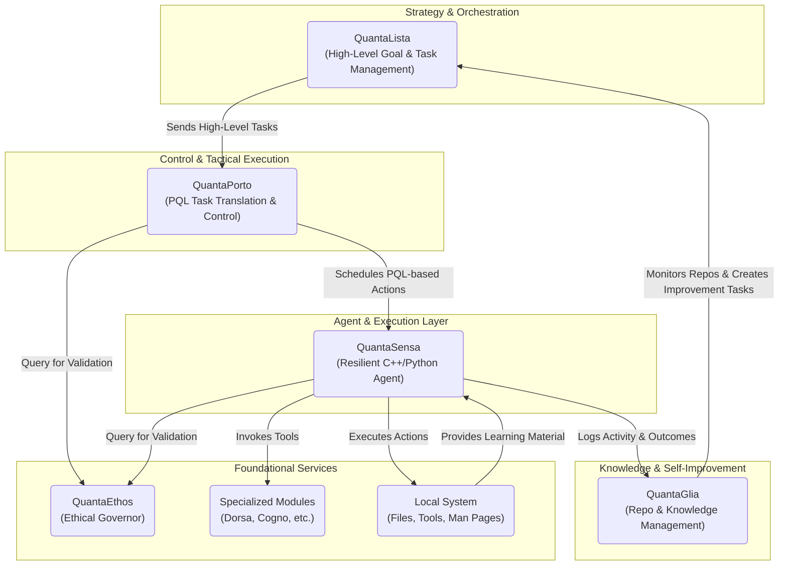

# PrismQuanta Ecosystem Integration Plan

## 1. Vision and Guiding Principles

The goal of this plan is to unify the discrete PrismQuanta modules into a single, cohesive, and autonomous system. The integration will adhere to the project's core philosophies:

-   **Local-First & Offline:** The integrated system must operate without external network dependencies, relying on local resources like `llama.cpp`.
-   **Modularity & Loose Coupling:** Components must be independently testable and replaceable. Communication should occur over well-defined, simple interfaces.
-   **Minimalism & Resilience:** Prefer simple, robust technologies (e.g., shell scripts, file-based queues, standard CLI tools) over complex frameworks to ensure stability in constrained environments.
-   **Ethical Governance:** `QuantaEthos` must be a foundational, non-bypassable layer for all significant actions undertaken by the system.

## 2. Proposed High-Level Architecture

The system will be organized into layers of responsibility, from high-level strategy to low-level execution.



### Component Roles:

-   **QuantaLista (Strategist):** Manages the master project plan. It breaks down high-level goals into a queue of tasks with dependencies and priorities. It is the main entry point for human oversight.
-   **QuantaPorto (Commander):** The tactical controller. It consumes tasks from `QuantaLista`, translates them into the structured **PQL (QuantaPorto Language)**, and schedules them for execution by the agent.
-   **QuantaSensa (Field Agent):** The hands of the system. Its C++ parent controller is responsible for picking up a single scheduled task from `QuantaPorto` and invoking its Python agent to execute it resiliently.
-   **QuantaGlia (Librarian):** The knowledge manager. It periodically analyzes the entire ecosystem's repositories and activity logs to prune, archive, or spawn new tools and documentation, feeding its findings back into `QuantaLista` as new tasks.
-   **QuantaEthos (Conscience):** A mandatory validation service. Before executing any potentially impactful command, `QuantaSensa` and `QuantaPorto` must query `QuantaEthos` to get a go/no-go decision and a trust score.

## 3. Communication and Data Flow Strategy

To maintain simplicity and resilience, a file-based communication protocol is recommended for the core workflow.

-   **Asynchronous Tasking (File-based Queue):**
    1.  `QuantaLista` writes a new task as a unique JSON file (e.g., `task-123.json`) into a shared `/queue/pending` directory.
    2.  `QuantaPorto` monitors this directory. It picks up a task, moves it to `/queue/in_progress`, and generates a corresponding PQL file and shell command for `QuantaSensa`.
    3.  `QuantaSensa`'s parent controller executes the command. Upon completion, it writes a result file (e.g., `result-123.json`) to `/queue/completed` and deletes the task from `/queue/in_progress`.
    4.  `QuantaLista` monitors the `/queue/completed` and `/queue/failed` directories to update its master plan.

    **Example `task-123.json`:**
    ```json
    {
      "task_id": "task-123",
      "description": "Refactor the logging module in QuantaSensa.",
      "priority": "high",
      "dependencies": ["task-115"],
      "component": "QuantaSensa",
      "max_runtime_sec": 300
    }
    ```

-   **Synchronous Validation (CLI Service):**
    -   `QuantaEthos` will be packaged as a standalone executable. Other components will call it via a shell command, passing the proposed action as an argument. `QuantaEthos` will print a JSON object with the validation result to `stdout`, which the calling component will parse.
    -   **Example Call:** `quanta-ethos "rm -rf /critical/data"`
    -   **Example `stdout` Response:**
        ```json
        {
          "decision": "deny",
          "reason": "High-risk command pattern 'rm -rf' detected on a protected path.",
          "trust_score": 0.1
        }
        ```

-   **Centralized Logging:**
    -   Each component will maintain its own detailed log file (e.g., `sensa_agent.log`).
    -   For key events, each component will also append a single, structured line to a central `events.jsonl` file. This provides a unified stream for monitoring tools like `QuantaPulsa` and `QuantaAlarma`.

## 4. Phased Integration Roadmap

### Phase 1: The Core Execution Loop (Sensa + Ethos + Porto)
1.  **Standardize Configuration:** Create a root `prismquanta.env` file to define all shared paths (queues, logs, repo locations). All scripts must source this file.
2.  **Package `QuantaEthos`:** Build `QuantaEthos` as a command-line tool that accepts a string and returns a JSON validation object.
3.  **Integrate `QuantaSensa` and `QuantaPorto`:**
    -   Modify `QuantaPorto` to generate a simple shell script for a given task.
    -   Modify `QuantaSensa`'s C++ parent controller to poll a directory for this script, execute it, and log the result.
    -   The parent controller **must** call the `QuantaEthos` CLI tool for validation before executing the script.

### Phase 2: High-Level Orchestration (Lista)
1.  **Implement `QuantaLista`:** Develop `QuantaLista` to manage the file-based task queue in `/queue/pending`. It should provide CLI commands to add, list, and prioritize tasks.
2.  **Connect `QuantaLista` to `QuantaPorto`:** `QuantaPorto` will now be driven by the tasks appearing in the queue managed by `QuantaLista`, forming the complete strategy-to-execution pipeline.
3.  **Implement Feedback Loop:** `QuantaLista` will monitor the `/queue/completed` and `/queue/failed` directories to track overall project progress.

### Phase 3: Self-Awareness and Knowledge Management (Glia)
1.  **Develop `QuantaGlia` Triggers:** `QuantaGlia` will be a scheduled process (e.g., cron job) that scans all project repositories and the central `events.jsonl` log.
2.  **Implement `QuantaGlia` Actions:** Based on its analysis (e.g., detecting repeated errors, identifying missing documentation), `QuantaGlia` will autonomously create new tasks and place them in `QuantaLista`'s queue.

### Phase 4: Full Ecosystem and Visualization
1.  **Integrate Specialized Modules:** Wrap modules like `QuantaDorsa` and `QuantaCogno` with simple CLI interfaces so they can be invoked as tools by `QuantaSensa` agents.
2.  **Activate Monitoring:** Develop `QuantaPulsa` and `QuantaAlarma` as services that tail the `events.jsonl` file to provide real-time system health monitoring and alerts.
3.  **Unify Visualization Tools:**
    -   **Short-Term:** Provide documentation for running Windows-based visualizers (`QuantaRetina`, `multiple_viewer`) in a container or VM.
    -   **Long-Term:** Re-implement the visualization logic using a cross-platform terminal library (e.g., `ncurses` in C++, `Textual` in Python) or as a simple local web application that reads data files.

## 5. Build and Deployment Strategy

-   **Unified Build System:** A top-level `Makefile` or `build_all.sh` script will orchestrate the build process for the entire ecosystem:
    -   Run `cmake` and `make` for all C++ components.
    -   Create Python virtual environments and install dependencies via `pip` for all Python components.
    -   Run `R` dependency installation scripts.
-   **Unified Testing:** A `test_all.sh` script will run unit and integration tests for each module, using mock components where necessary to ensure isolated and repeatable testing.
-   **Master Control Script:** A `start_system.sh` script will launch all necessary components in the correct order (e.g., monitoring daemons, `QuantaLista` in a watch loop).

## 6. Challenges and Mitigations

### Challenge 1: Concurrency and Race Conditions
**Description:** With multiple components monitoring file-based queues, there is a risk of two processes attempting to claim the same task file simultaneously, leading to duplicated or lost work.
**Mitigation:**
-   **Atomic Operations:** Use atomic file system operations like `mv`. On POSIX-compliant systems, `mv` is an atomic operation within the same filesystem, ensuring that a file "move" is an all-or-nothing action.
-   **Locking Mechanism:** Before processing a file in `/queue/pending`, a component will attempt to create a corresponding `.lock` file (e.g., `task-123.json.lock`). If the lock file creation succeeds, the component has exclusive access. The lock file is deleted upon completion.

### Challenge 2: State Management and Crash Recovery
**Description:** If a component (e.g., `QuantaSensa`) crashes while a task is in the `/queue/in_progress` directory, the task will be orphaned and never completed.
**Mitigation:**
-   **Task Timeouts:** Each task JSON will include a `max_runtime_sec` field.
-   **Reaper Process:** A "reaper" function within `QuantaLista` will periodically scan the `/queue/in_progress` directory. If a task's file modification time exceeds its `max_runtime_sec`, it will be moved to a `/queue/failed` directory. A detailed failure log will be generated, noting the timeout.

### Challenge 3: Local LLM Performance Bottlenecks
**Description:** The synchronous validation call to `QuantaEthos` could become a significant bottleneck if the local LLM is slow, delaying every critical action across the system.
**Mitigation:**
-   **Model Tiering:** Use smaller, faster, quantized models specifically for `QuantaEthos`. The ethical validation task is often a classification or simple pattern-matching problem that doesn't require a large, powerful model.
-   **Prompt Engineering:** Design prompts for `QuantaEthos` to be extremely concise and require a simple, structured output (e.g., a single JSON object), minimizing token generation time.
-   **Caching:** Implement a simple cache (e.g., an in-memory map or a file-based key-value store) within `QuantaEthos`. If an identical command is validated multiple times within a short period, return the cached decision.

### Challenge 4: Cross-Platform Compatibility
**Description:** The ecosystem involves C++, Python, R, and shell scripts, intended to run on both Linux and Windows. Differences in file paths, shell commands (`rm` vs `del`), and system APIs pose a significant integration challenge.
**Mitigation:**
-   **Configuration Abstraction:** Strictly enforce the use of the `prismquanta.env` file for all paths. Scripts should source this file to get environment-specific locations.
-   **Containerization (Short-Term):** For Windows-specific components like the visualizers, the recommended deployment method will be within a container (Docker) or a Linux environment via WSL2. This isolates them from the host and provides a consistent Linux environment.
-   **Cross-Platform Tooling (Long-Term):** Prioritize re-implementing critical UI components using cross-platform technologies (e.g., a simple web server in Python with a web UI, or a terminal UI library like `Textual`).
-   **Conditional Logic in Scripts:** Where unavoidable, use conditional logic in shell scripts to detect the OS (`if [[ "$OSTYPE" == "linux-gnu"* ]]`) and execute the appropriate command.

### Challenge 5: Integration Testing Complexity
**Description:** Testing the interaction between multiple asynchronous components written in different languages is inherently difficult.
**Mitigation:**
-   **Mock Components:** Develop lightweight, mock versions of key executables for testing purposes. For example, a `mock_quanta_ethos` script that always returns an "approved" JSON, or a `mock_sensa_agent` that immediately creates a success result file.
-   **Dedicated Test Suite:** Create an integration test script (`test_integration.sh`) that:
    1.  Sets up a temporary queue directory structure.
    2.  Launches the components under test (e.g., `QuantaLista`, `QuantaPorto`).
    3.  Uses mock components for dependencies (like `QuantaSensa`).
    4.  Places a series of test task files into `/queue/pending`.
    5.  Asserts that the expected result files appear in `/queue/completed` or `/queue/failed` within a timeout.
    6.  Cleans up all temporary files and processes.

## 7. Component-Specific Integration Details

### QuantaEthos (The Conscience)
-   **Interface:** Standalone CLI executable (`quanta-ethos`).
-   **Input:** A single string argument containing the command or action to be validated.
-   **Output:** A single JSON object to `stdout`.
-   **Implementation:**
    -   Must be extremely lightweight. It will be called frequently and should have minimal startup overhead.
    -   Will use a dedicated, highly quantized LLM optimized for classification and safety tasks.
    -   Will contain a non-LLM-based rules engine for immediate denial of high-risk patterns (e.g., `rm -rf /`, `> /dev/sda`).
    -   The `trust_score` will be a float between 0.0 and 1.0, allowing consuming services to set their own acceptance thresholds.

### QuantaPorto (The Commander)
-   **Primary Loop:**
    1.  Scan `/queue/pending` for the highest priority task file.
    2.  Use an atomic `mv` to move the task file to `/queue/in_progress`, effectively locking it.
    3.  Parse the task JSON.
    4.  Invoke its internal LLM to translate the natural language `description` into a structured PQL command or a shell script.
    5.  **Self-Validation:** Before finalizing, `QuantaPorto` can optionally call `quanta-ethos` on its generated script as a pre-check.
    6.  Write the final executable script to a new file in a `/actions/pending` directory, named with the same task ID (e.g., `task-123.sh`).
    7.  The original task file remains in `/queue/in_progress` as a record of the active job.

### QuantaSensa (The Field Agent)
-   **Parent Controller (C++) Loop:**
    1.  Scan `/actions/pending` for a script file.
    2.  Atomically move the script to `/actions/in_progress`.
    3.  Read the script content.
    4.  **Mandatory Validation:** Execute `quanta-ethos` with the script content as input. If the decision is `deny`, move the script to `/actions/failed` and create a corresponding failure result in `/queue/failed`. Abort this task.
    5.  If approved, execute the script, capturing `stdout` and `stderr`.
    6.  Upon completion, create a `result-123.json` file in `/queue/completed` (or `/queue/failed` if the script returned a non-zero exit code). The result file should contain the original task ID, status, and any captured output.
    7.  Delete the script from `/actions/in_progress` and the original task file from `/queue/in_progress`.

### QuantaLista (The Strategist)
-   **User Interface:** A simple CLI tool (`quantalista-cli`) will provide the primary human interface.
    -   `quantalista-cli add --priority high "Deploy the new monitoring script."` -> Creates a new task file in `/queue/pending`.
    -   `quantalista-cli list` -> Displays tasks in all queues.
    -   `quantalista-cli status <task_id>` -> Shows the current state and history of a task.
-   **Monitoring Daemon:** A background process will continuously monitor `/queue/completed` and `/queue/failed` to update a central state ledger (e.g., a simple SQLite database or a master JSON file) that tracks the history and outcome of all tasks.

### QuantaGlia (The Librarian)
-   **Trigger:** Will be executed via a system scheduler (e.g., a cron job) on a configurable interval (e.g., once every 6 hours).
-   **Execution Flow:**
    1.  Scan all repository directories defined in `prismquanta.env`.
    2.  Analyze git history, file sizes, and modification times.
    3.  Scan the central `events.jsonl` for patterns (e.g., repeated command failures).
    4.  Use its internal LLM to reason about potential improvements (e.g., "The `test_model_config.sh` script has failed 5 times with the same error. A task should be created to investigate.").
    5.  Generate a new task JSON file and place it directly into `QuantaLista`'s `/queue/pending` directory. The task description will contain the justification for its creation.

## 8. Monitoring and Observability Strategy

The central `events.jsonl` file is the backbone of system observability. Every significant action from any component should be logged here.

### `events.jsonl` Structure
Each line is a self-contained JSON object.
```json
{
  "timestamp": "2023-10-27T10:00:05Z",
  "component": "QuantaSensa",
  "level": "INFO",
  "event_type": "action_execution_start",
  "message": "Executing script for task-123.",
  "metadata": {
    "task_id": "task-123",
    "script_path": "/path/to/actions/in_progress/task-123.sh"
  }
}
```

### Monitoring Tools
-   **QuantaPulsa (Real-time Dashboard):** A terminal-based tool (e.g., using Python's `Textual` or `curses`) that tails `events.jsonl`. It will provide a live-updating dashboard showing:
    -   The current count of tasks in each queue (`pending`, `in_progress`, `failed`).
    -   A real-time stream of the latest events.
    -   A summary of recent errors.
    -   CPU/Memory usage of the host system.
-   **QuantaAlarma (Alerting Daemon):** A lightweight background service that also tails `events.jsonl`. It will read a configuration file (`alarms.yaml`) to trigger actions based on event patterns.
    -   **Example `alarms.yaml` rule:**
      ```yaml
      - name: "High-Risk Action Approved"
        condition:
          event_type: "ethos_validation_complete"
          metadata.trust_score: "< 0.5"
          metadata.decision: "approve"
        action: "send_email --to admin@local.host --subject 'Low-Trust Action Approved'"
      ```

## 9. Human-in-the-Loop (HITL) and Safety Controls

The system must be designed for safe human oversight and intervention.

### System-Wide Pause
-   A "pause" file (e.g., `/run/prismquanta.pause`) will act as a global stop signal.
-   Before starting any new task processing loop, every component (`QuantaPorto`, `QuantaSensa`, etc.) **must** check for the existence of this file.
-   If the file exists, the component should log that it is paused and wait, checking for the file's removal every few seconds.
-   A simple `system_pause.sh` and `system_resume.sh` script will create and remove this file.

### Manual Task Approval
-   A special queue directory, `/queue/human_approval`, will be created.
-   `QuantaEthos` can be configured to respond with a `defer_to_human` decision for ambiguous or high-impact commands.
-   When a component receives this decision, it will move the corresponding task file to the `/queue/human_approval` directory.
-   The system will take no further action on this task until a human operator manually inspects the task file and moves it back to `/queue/pending` to be re-processed.

### Interactive Review
-   A CLI tool (`quantalista-cli review`) will provide an interactive session for managing the `human_approval` queue. It will allow an operator to:
    -   List all tasks pending approval.
    -   View the content of the task and the proposed action.
    -   Approve (move to `/queue/pending`), Deny (move to `/queue/failed`), or Edit the task.